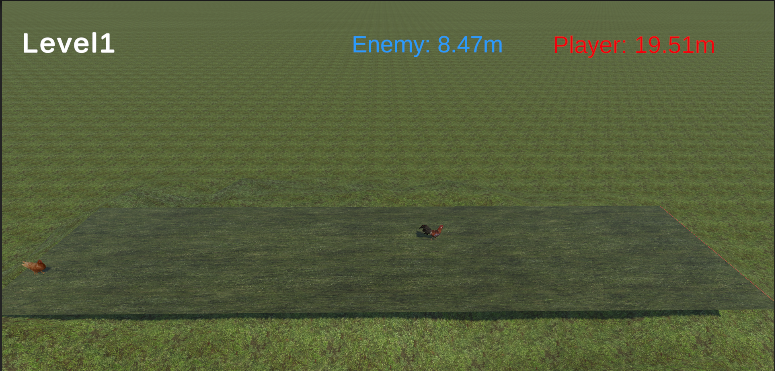

# game_of_real_chicken_privacy_policy

# What is Game of Real Chicken

- Real chickens play game of chicken.
- You swipe to move the chicken.
- The shorter distance chicken to the cliff wins.

# Asset

These follows assets are used in this game.

- [2D Casual UI HD](https://assetstore.unity.com/packages/2d/gui/icons/2d-casual-ui-hd-82080)
  - Publisher: MiMU STUDIO
- [Arcade Game BGM #17](https://assetstore.unity.com/packages/audio/music/arcade-game-bgm-17-210775)
  - Publisher: B.G.M
- [Animals - Chicken](https://assetstore.unity.com/packages/3d/characters/animals/birds/animals-chicken-510)
  - Publisher: Robin Schmidt
- [Grass Flowers Pack Free](https://assetstore.unity.com/packages/2d/textures-materials/nature/grass-flowers-pack-free-138810)
  - Publisher: ALP8310
- [Yughues Free Ground Materials](https://assetstore.unity.com/packages/2d/textures-materials/floors/yughues-free-ground-materials-13001)
  - Publisher:Nobiax / Yughues
