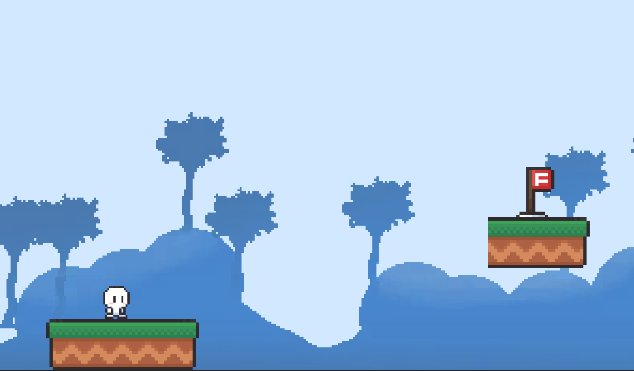

# swipe_shoot_privacy_policy

# What is Swipe Shoot

- Swipe to send the character flying to the goal.
- This game contains ads.

# Asset

These follows assets are used in this game.

- [2D Casual UI HD](https://assetstore.unity.com/packages/2d/gui/icons/2d-casual-ui-hd-82080)
  - Publisher: MiMU STUDIO
- [Casual Game BGM #5](https://assetstore.unity.com/packages/audio/music/casual-game-bgm-5-135943)
  - Publisher: B.G.M
- [FREE Casual Game SFX Pack](https://assetstore.unity.com/packages/audio/sound-fx/free-casual-game-sfx-pack-54116)
  - Publisher: Dustyroom
- [Pixel Tiles Pack](https://assetstore.unity.com/packages/2d/environments/pixel-tiles-pack-138879)
  - Publisher: Blue Crystal Studio
- [Simple 2D Platformer Assets Pack](https://assetstore.unity.com/packages/2d/characters/simple-2d-platformer-assets-pack-188518)
  - Publisher: Goldmetal
- [Sunny Land](https://assetstore.unity.com/packages/2d/characters/sunny-land-103349)
  - Publisher: Ansimuz
